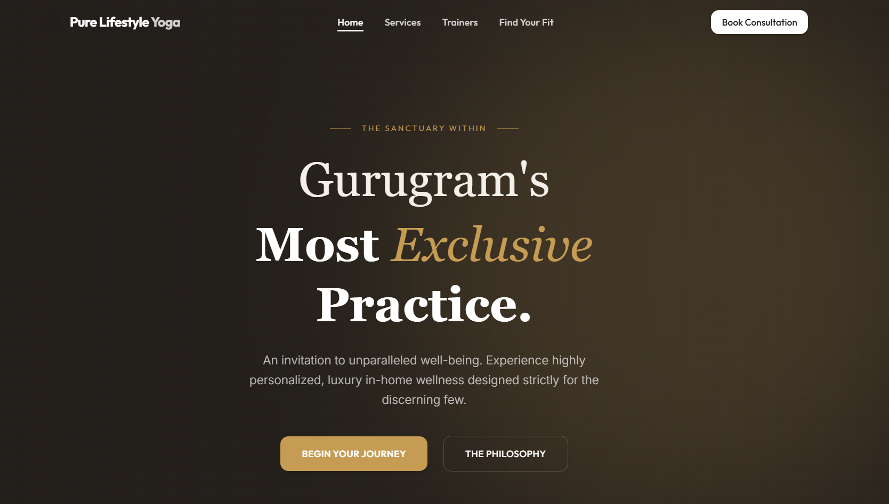
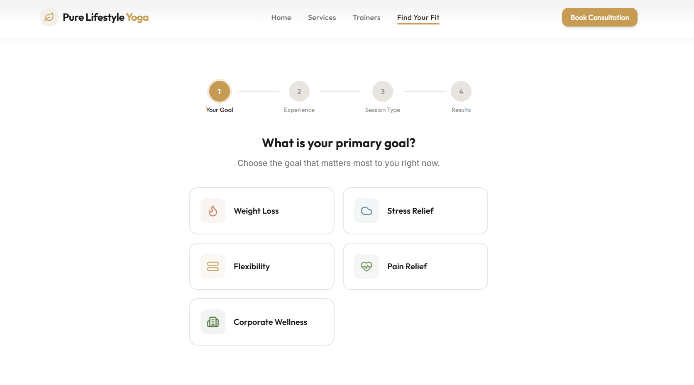

<div align="center">
  <h1>Pure Lifestyle Yoga</h1>
  <p>
    <strong>A Premium, High-Performance Yoga Consultation & Booking Platform</strong>
  </p>
    
 
    

</div>

<hr />

## Overview

**Pure Lifestyle Yoga** is an exclusive web platform tailored for luxury, in-home wellness experiences. The platform empowers clients to explore curated yoga services, discover expert educators, and securely book personalized consultations. Engineered for speed and elegance, the application features a custom design system, seamless micro-animations, and a fully integrated backend for real-time lead and booking management.

## 📑 Table of Contents
- [Features](#-features)
- [Tech Stack](#-tech-stack)
- [Project Structure](#-project-structure)
- [Getting Started](#-getting-started)
  - [Prerequisites](#1-prerequisites)
  - [Installation](#2-installation)
  - [Database Configuration](#3-database-configuration-supabase)
- [Available Scripts](#-available-scripts)
- [Deployment](#-deployment)

---

## Features

- **Exclusive UI/UX:** Custom-built design system leveraging a premium color palette (Espresso, Muted Gold, Cream).
- **Dynamic Booking Engine:** Intuitive, multi-step booking forms directly connected to a real-time database.
- **Automated Lead Capture:** Integrated "5 Yoga Habits" lead magnet designed to capture and store prospective client data seamlessly.
- **Admin Dashboard:** A built-in, secure interface allowing administrators to view and manage incoming leads and booking requests.
- **Fully Responsive & Accessible:** Fluid layouts optimized across all modern browsers and devices (mobile, tablet, desktop).

---

## Tech Stack

### Frontend Architecture
- **Framework:** [React.js](https://react.dev/)
- **Build Engine:** [Vite](https://vitejs.dev/)
- **Styling:** [Tailwind CSS v4](https://tailwindcss.com/)
- **Routing:** React Router DOM
- **Icons:** Lucide React

### Backend & Database
- **BaaS (Backend-as-a-Service):** [Supabase](https://supabase.com/)
- **Database:** PostgreSQL (with Row Level Security)
- **Data Fetching:** Custom React Hooks with built-in caching and error handling.

---

## Project Structure

```text
pure-lifestyle-yoga/
├── public/                 # Static assets (images, fonts)
├── src/
│   ├── components/         # Reusable UI, layout, and feature components
│   ├── data/               # Seed data for UI (Services, Trainers)
│   ├── hooks/              # Custom React hooks (Supabase logic)
│   ├── lib/                # Third-party integrations (Supabase client)
│   ├── pages/              # Primary route components (Home, Booking, Admin)
│   ├── utils/              # Helper functions (Formatting, Utilities)
│   ├── App.jsx             # Root application and routing wrapper
│   └── index.css           # Global styles and Tailwind base layers
├── supabase_schema.sql     # Database initialization script
├── .env.example            # Environment variable template
├── package.json            # Project dependencies and scripts
└── vite.config.js          # Vite configuration
```

---

##  Getting Started

Follow these instructions to set up the project locally for development and testing.

### 1. Prerequisites
- **Node.js** (v18.0.0 or higher recommended)
- **npm** (v9.0.0 or higher)
- A free **[Supabase](https://supabase.com/)** account for database hosting.

### 2. Installation
Clone the repository and install the dependencies:
```bash
git clone <repository-url>
cd pure-lifestyle-yoga
npm install
```

### 3. Database Configuration (Supabase)
This project requires a backend database to store form submissions.
1. Create a new project in your Supabase dashboard.
2. Navigate to the **SQL Editor** in Supabase.
3. Open the `supabase_schema.sql` file located in the root of this repository. Copy all the code and execute it in the SQL Editor. *This will instantly create your tables, apply security policies, and seed default data.*
4. In Supabase, go to **Project Settings > API** and locate your `Project URL` and `anon public key`.

### 4. Environment Variables
Create a `.env` file in the root directory and add your Supabase credentials:
```env
VITE_SUPABASE_URL=your_project_url_here
VITE_SUPABASE_ANON_KEY=your_anon_key_here
```

---

## Available Scripts

In the project directory, you can run:

- `npm run dev`: Starts the Vite development server with Hot Module Replacement (HMR).
- `npm run build`: Compiles the application for production, outputting optimized static assets to the `dist` folder.
- `npm run preview`: Bootstraps a local web server to serve the production build from the `dist` folder.

---

## 🚢 Deployment

This application is strictly optimized for modern edge networks and is fully compatible with zero-configuration deployments on **Vercel**.

1. Commit all your changes and push the repository to **GitHub**.
2. Log into [Vercel](https://vercel.com/) and click **Add New > Project**.
3. Import your GitHub repository.
4. Expand the **Environment Variables** section and inject your `VITE_SUPABASE_URL` and `VITE_SUPABASE_ANON_KEY`.
5. Click **Deploy**.

Vercel will automatically detect the Vite build settings and launch the application within seconds.
